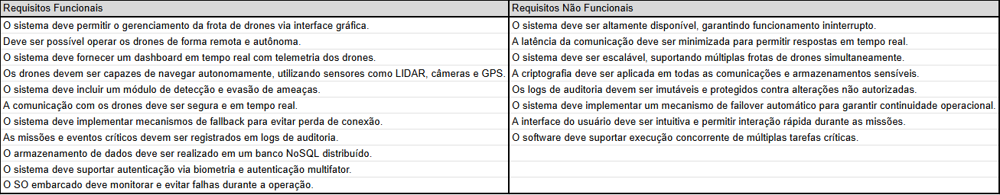

<h2><a href= "https://www.mackenzie.br">Universidade Presbiteriana Mackenzie</a></h2>
<h3><a href= "https://www.mackenzie.br/graduacao/sao-paulo-higienopolis/ciencia-da-computacao">Ciência da Computação</a></h3>

*&lt;FALCÃO SOMBRIO&gt;*

**Conteúdo**

- [Autores](#nome-alunos)
- [Descrição do Projeto](#introdução-do-projeto)
- [Análise de Requisitos Funcionais e Não-Fucionais](#descrição-dos-requisitos)
- [Diagrama de Atividades](#diagrama-de-atividades) 
- [Diagrama de Casos de Uso](#diagrama-de-comportamento-atores)
- [Descrição dos Casos de Uso](#descrição-das-funcões)
- [Diagrama de Senquencia](#diagrama-de-ordem-interações)
- [Diagrama de Classes](#diagrama-orientado-objetos)
- [Diagrama de Estados](#diagrama-estrutura-componente)
- [Diagrama de Implantação](#diagrama-de-hardware-software)
- [Referências](#referências)

# Autores

* Bruna Soncini Nunes
* Gabriel Nottoli Buck
* Joao Vitor Rocha Miranda
* Julia Andrade

# Descrição do Projeto

A Securus Dynamics é uma empresa multinacional que desenvolve drones bélicos autônomos para operações militares. Seu principal produto, o Aquila-X, usa IA e sensores avançados para missões táticas, reconhecimento e ataques de precisão.

A empresa está criando o **Falcão Sombrio**, um novo sistema para controle remoto e autônomo dos drones via rede distribuída e interface avançada. O projeto enfrenta desafios em sistemas operacionais (tempo real, segurança e concorrência) e banco de dados (armazenamento distribuído, replicação e auditoria).

Devido a falhas na arquitetura atual, a empresa contratou a **Cyber Bullet System (Turma 4G)** para redesenhar o software e o banco de dados que suportam as operações críticas dos drones.

# Análise de Requisitos Funcionais e Não-Funcionais
## Introdução 

O **Sistema Falcão Sombrio** tem como objetivo permitir a operação remota e autônoma de drones militares através de uma infraestrutura distribuída e uma interface operacional avançada. O sistema deve garantir segurança, eficiência e confiabilidade em missões táticas, reconhecimento em território hostil e ataques de precisão. O sistema será baseado em uma arquitetura distribuída, garantindo maior confiabilidade e disponibilidade.

O sistema abrange as seguintes funcionalidades principais:
- Controle de drones via interface remota e operações autônomas.
- Sensoriamento inteligente para navegação, detecção e evasão de ameaças.
- Gerenciamento de comunicação em tempo real e protocolos de fallback para evitar falhas.
- Banco de dados seguro e distribuído, com logs de auditoria imutáveis.
- Autenticação avançada para garantir acesso autorizado.

O sistema tem como público alvo:
- Operadores militares responsáveis pelo controle dos drones.
- Engenheiros de software e segurança encarregados da manutenção e evolução do sistema.
- Arquitetos de software focados na infraestrutura distribuída e no gerenciamento de dados.

## Descrição Geral
O projeto envolve desafios de sistemas operacionais (tempo real, segurança e concorrência), além de banco de dados (armazenamento distribuído, replicação e logs de auditoria). A Consultoria Cyber Bullet System deve reformular toda a arquitetura de software e definir um novo modelo de
banco de dados para suportar as operações críticas dos drones. 

## Requisitos Funcionais e Não Funcionais

## Interfaces do Sistema
### Telas e Interações Principais
- Tela de Login para autenticação via usuário e senha, com suporte a biometria.
- Painel de Controle para visualização e controle da frota de drones.
- Tela de Missão para exibir a rota, status da missão e eventos críticos em tempo real.
- Tela de Logs para histórico de operações, falhas e outros eventos críticos.

## Restrições
Tecnológicas:
- O sistema deve operar em uma arquitetura distribuída com bancos NoSQL.
- O sistema deve suportar protocolos seguros de comunicação em tempo real.

Legais:
- O sistema deve seguir normas de cibersegurança e proteção de dados militares.

Operacionais:
- O sistema deve ser capaz de operar em ambientes hostis, sem conexão constante com servidores centrais.

## Critérios de Aceitação
- Garantir a continuidade da operação entre servidores e componentes do sistema (failover).
- Garantir a operação dos drones em situações de falha de comunicação (fallback).
- Todos os eventos críticos devem ser registrados corretamente nos logs de auditoria.
- O sistema deve impedir acesso não autorizado e tentativas de invasão devem ser detectadas.
- A interface deve exibir dados de telemetria em tempo real.

# Diagrama de Atividades

*&lt;Diagrama para visualizer as pessoas das áreas de negócios e de desenvolvimento de uma organização para entender o processo e comportamento.&gt;*

# Diagrama de Casos de Uso

*&lt;Diagrama para visualizar o comportamento dos atores&gt;*

# Descrição dos Casos de Uso

*&lt;Descrição do comportamento entre os atores/resquisitos&gt;*

# Diagrama de Sequência

*&lt;Diagrama de ordem e interação dos objetos&gt;*

# Diagrama de Classes

*&lt;Diagrama de relacionamento entre classes para os seus atributos e operações&gt;*

# Diagrama de Estados

*&lt;Diagrama para permite modelar o comportamento interno de um determinado objeto, subsistema ou sistema global&gt;*

# Diagrama de Implantação

*&lt;Diagrama para exibir o relacionamento de hardware e software no projeto&gt;*

# Referências

*&lt;Lista de referências&gt;*
