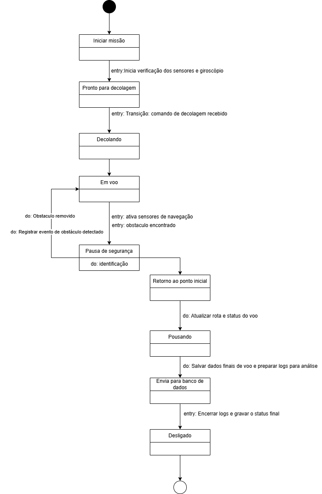

<h2><a href= "https://www.mackenzie.br">Universidade Presbiteriana Mackenzie</a></h2>
<h3><a href= "https://www.mackenzie.br/graduacao/sao-paulo-higienopolis/ciencia-da-computacao">Ciência da Computação</a></h3>

*&lt;FALCÃO SOMBRIO&gt;*

**Conteúdo**

- [Autores](#nome-alunos)
- [Descrição do Projeto](#descrição-do-projeto)
- [Análise de Requisitos Funcionais e Não-Funcionais](#Análise-de-Requisitos-Funcionais-e-Não-Funcionais)
- [Diagrama de Atividades](#diagrama-de-atividades) 
- [Diagrama de Casos de Uso](#diagrama-de-casos-de-uso)
- [Descrição dos Casos de Uso](#descrição-dos-casos-de-uso)
- [Diagrama de Sequencia](#diagrama-de-sequência)
- [Diagrama de Classes](#diagrama-de-classes)
- [Diagrama de Estados](#diagrama-de-estados)
- [Diagrama de Implantação](#diagrama-de-implantação)
- [Referências](#referências)

# Autores

* Bruna Soncini Nunes
* Gabriel Nottoli Buck
* Joao Vitor Rocha Miranda
* Julia Andrade

# Descrição do Projeto

A Securus Dynamics é uma empresa multinacional que desenvolve drones bélicos autônomos para operações militares. Seu principal produto, o Aquila-X, usa IA e sensores avançados para missões táticas, reconhecimento e ataques de precisão.

A empresa está criando o **Falcão Sombrio**, um novo sistema para controle remoto e autônomo dos drones via rede distribuída e interface avançada. O projeto enfrenta desafios em sistemas operacionais (tempo real, segurança e concorrência) e banco de dados (armazenamento distribuído, replicação e auditoria).

Devido a falhas na arquitetura atual, a empresa contratou a **Cyber Bullet System (Turma 4G)** para redesenhar o software e o banco de dados que suportam as operações críticas dos drones.

# Análise de Requisitos Funcionais e Não-Funcionais
## Requisitos Funcionais (O que o sistema deve fazer)

### Requisitos Não Funcionais (Como o sistema deve operar)

# Diagrama de Atividades

# Diagrama de Casos de Uso

# Descrição dos Casos de Uso

## Operador - Militar

## Administrador

# Diagrama de Sequência

# Diagrama de Classes

# Diagrama de Estados

# Diagrama de Implantação

# Referências

1. BOOCH, Grady; RUMBAUGH, James; JACOBSON, Ivar. *UML: Guia do Usuário*. 2. ed. Rio de Janeiro: Elsevier, 2006.

2. FOWLER, Martin. *UML Essencial: Um Breve Guia Para a Linguagem Padrão de Modelagem de Objetos*. 3. ed. Porto Alegre: Bookman, 2005.

3. LARMAN, Craig. *Utilizando UML e Padrões: Uma Introdução à Análise e ao Projeto Orientados a Objetos e ao Processo Unificado*. 3. ed. Porto Alegre: Bookman, 2007.

4. SOMMERVILLE, Ian. *Engenharia de Software*. 10. ed. São Paulo: Pearson, 2019. Capítulo sobre modelagem UML.

5. OBJECT MANAGEMENT GROUP. *Unified Modeling Language (UML), Version 2.5.1*. Disponível em: [https://www.omg.org/spec/UML/2.5.1](https://www.omg.org/spec/UML/2.5.1). Acesso em: 14 mai. 2025.

6. SILVA, Rodrigo. *Aulas 02 - 15 – Diagramas UML*. Projeto de Software, Bacharelado em Ciência da Computação, Universidade Presbiteriana Mackenzie. 2025. Material da disciplina.

